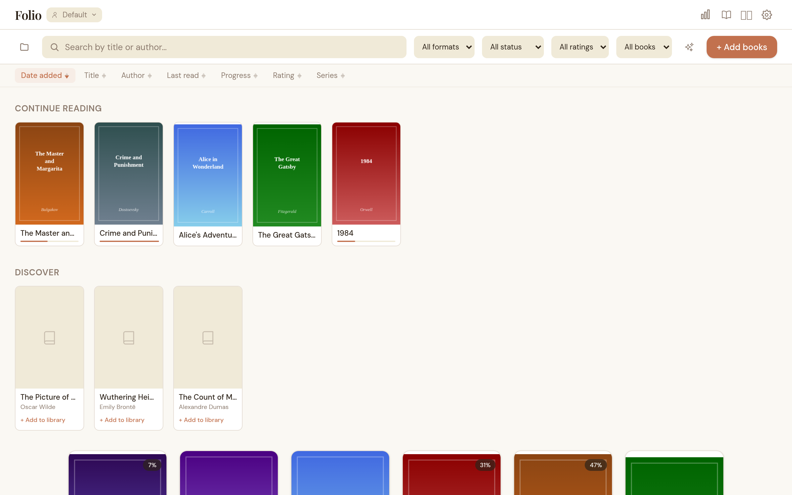
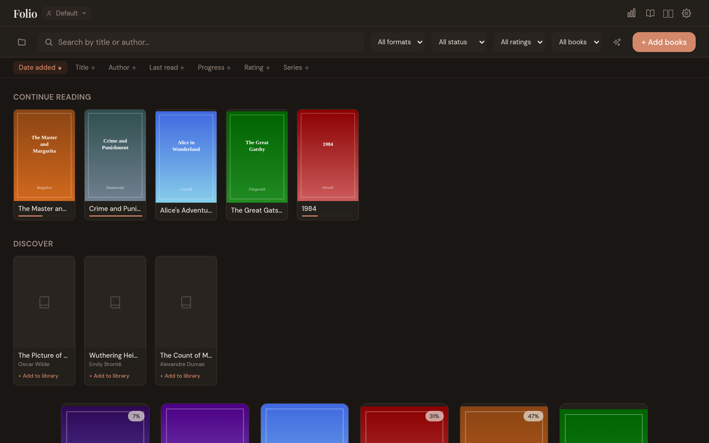
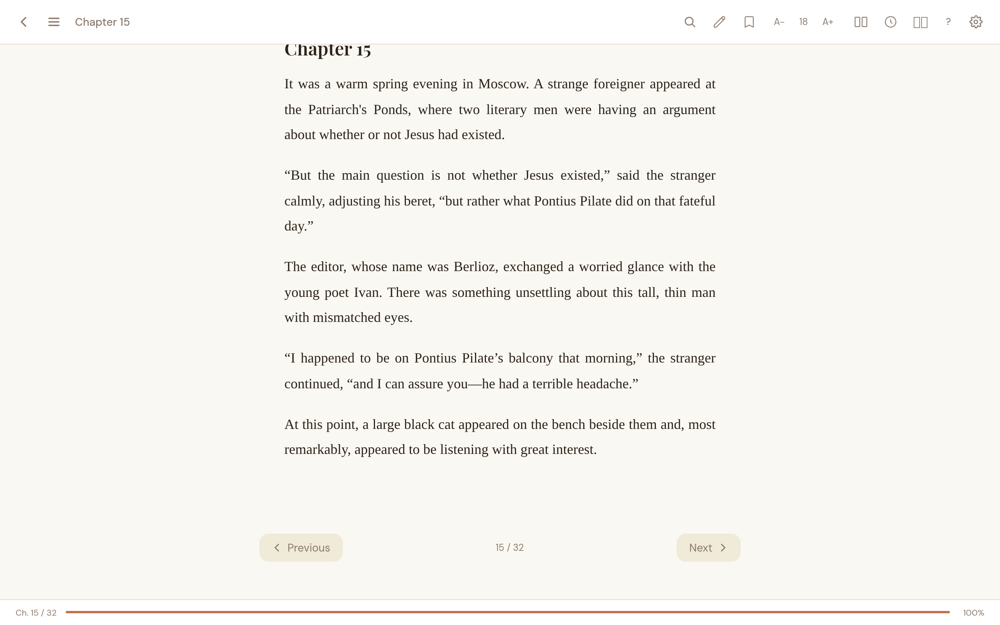
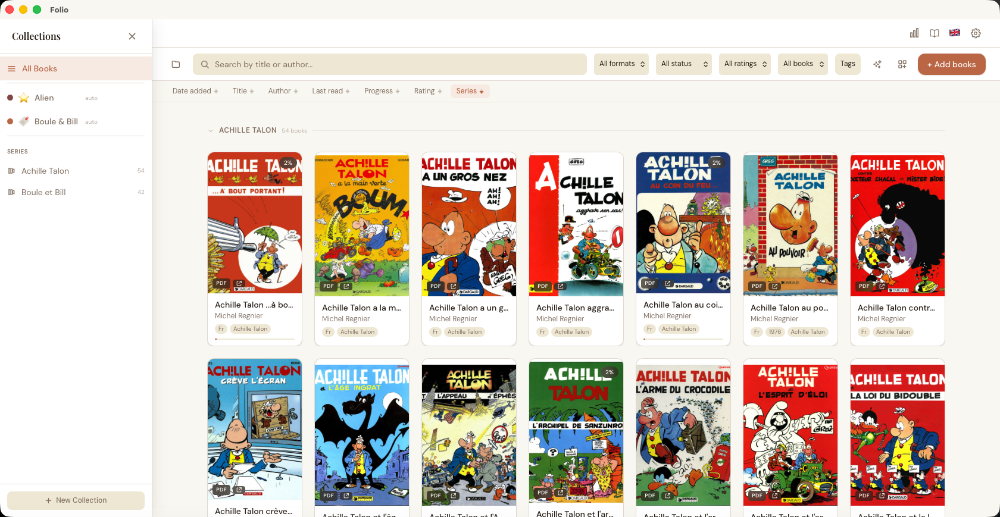
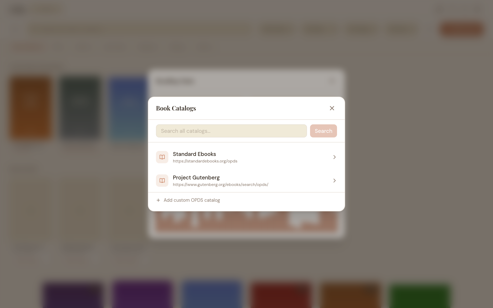
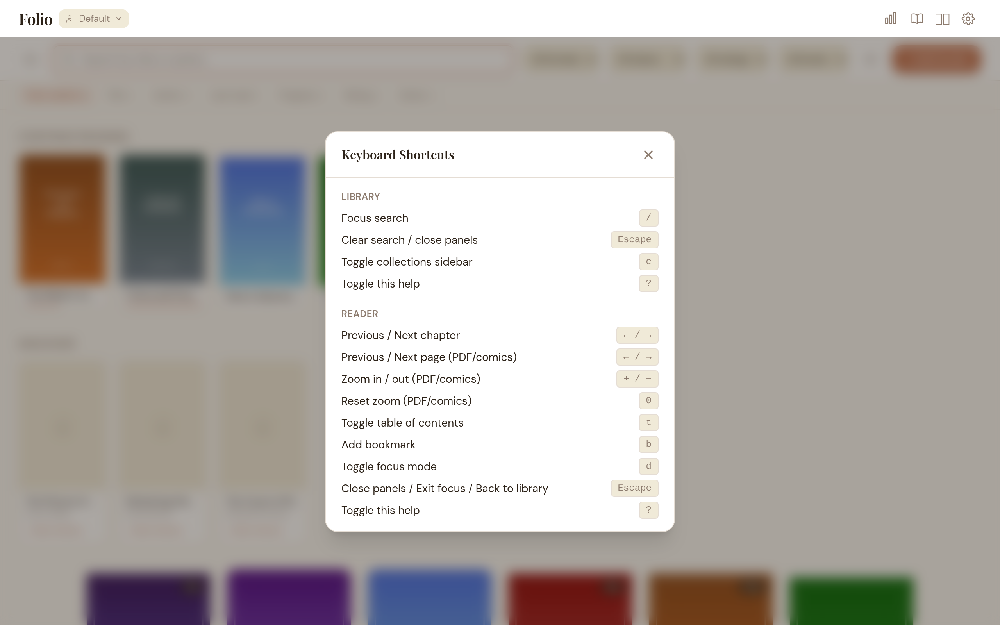

# Folio

A local-first desktop app for people who want to read and organize the books they already own.



Folio is a cross-platform reader for EPUB, MOBI / AZW / AZW3, PDF, CBZ, and CBR. It keeps your library on your machine and gives you the tools to actually use it well: solid reading controls, sensible organization, metadata cleanup, highlights, profiles, backup, and OPDS catalog support.

## Why Folio?

A lot of reading apps try to funnel you into a store, an account, or somebody else's ecosystem.

Folio is for the opposite case: you already have the files, and you want a better home for them.

- Local-first: your books and reading data stay on your machine
- Built for owned files: EPUBs, PDFs, and comics without vendor lock-in
- Good to read in: typography, themes, focus mode, highlights, bookmarks, and progress tracking
- Good to manage: collections, tags, metadata editing, profiles, ratings, backups, and activity history

## Highlights

### Reading
- EPUB 2 & 3 reader with sanitized HTML rendering
- PDF support via bundled Pdfium
- CBZ and CBR comic reading
- EPUB paginated mode and continuous scroll mode
- Table of contents sidebar and chapter navigation
- Full-text search inside EPUB books (`⌘/Ctrl+F`)
- Focus mode for distraction-free reading
- Bookmarks, highlights, and highlight notes
- Time-to-finish estimate for EPUB books
- Adjustable font size and advanced typography controls
- Built-in themes: Light, Sepia, Dark, Auto
- Custom fonts and custom CSS override for EPUB content

### Library
- Built for large libraries — a virtualized cover grid and lightweight thumbnails stay smooth with thousands of books
- Import via file picker, drag-and-drop, direct URL, or folder scan
- Copy-on-import into an app-managed library folder
- Duplicate detection using SHA-256 file hashing
- Search by title or author
- Sort by date added, last read, title, author, progress, or rating
- Filter by format, reading status, and minimum rating
- Manual and rule-based collections
- Tags with autocomplete
- Metadata editing: title, author, series, language, publisher, cover, rating, tags
- Recently opened books for quick resume
- Multiple profiles with separate libraries

### Catalogs, metadata, and backup
- OPDS catalog browsing
- Built-in catalogs such as Project Gutenberg and Standard Ebooks
- Add custom OPDS catalog URLs
- One-click download from catalogs into your library
- Metadata enrichment via OpenLibrary and provider-based scanning
- Library export and backup
- Restore from backup archive
- Activity log for imports, edits, deletes, collection changes, and more
- Reading stats dashboard

### Remote access
- Read your library from any device on the same WiFi — phone, tablet, or another computer, no install required
- Built-in web reader with QR-code pairing and PIN login
- OPDS server so ebook apps (KOReader, Thorium, Calibre, Moon+ Reader) can connect directly
- Read-only and sanitized; PIN hashed in your OS keychain, with rate-limited logins and a login audit trail
- System tray toggles to flip the Web UI and OPDS server on or off

### Extensibility
- Plugin system — small sandboxed scripts that react to events (book imported, highlight created, book finished, …)
- Deny-by-default permissions with an explicit consent dialog per plugin
- Bundled example plugins: auto-tag on import, finish notifications, Markdown highlight export, OPDS auto-download
- See [`docs/PLUGINS.md`](docs/PLUGINS.md) to write your own

### Interface
- Multi-language UI — English and French, with OS-language auto-detection
- Cross-platform desktop app for macOS, Windows, and Linux

## Screenshots

<details open>
<summary>Dark mode</summary>


</details>

<details>
<summary>EPUB reader</summary>


</details>

<details>
<summary>Highlights & annotations</summary>


</details>

<details>
<summary>Reading stats</summary>


</details>

<details>
<summary>Collections</summary>


</details>

<details>
<summary>Book details</summary>


</details>

<details>
<summary>OPDS catalogs</summary>


</details>

<details>
<summary>Remote access</summary>


</details>

<details>
<summary>Keyboard shortcuts</summary>


</details>

## Docs

- User guide: [`docs/USER_GUIDE.md`](docs/USER_GUIDE.md)
- Changelog: [`docs/changelog.html`](docs/changelog.html) ([raw](CHANGELOG.md))
- Roadmap: [`docs/ROADMAP.md`](docs/ROADMAP.md)

## Installation

Pre-built binaries are available on the [GitHub Releases page](https://github.com/mikedamoiseau/folio/releases).

### macOS

Open the `.dmg`, drag **Folio.app** to **Applications**, then launch it.

#### macOS Gatekeeper: "damaged" / "unidentified developer" warning

Because Folio is not currently notarized with an Apple Developer certificate, macOS may block it on first launch.

Run this once after installing:

```bash
xattr -cr /Applications/Folio.app
```

Then launch the app normally.

#### macOS SMB shares: import fails for accented filenames

Importing from an SMB network share (NAS) can fail with `No such file or directory (os error 2)` for files whose names contain accented characters (`é`, `à`, …). This is a macOS SMB-client bug, not a Folio one — the file is intact on the server but macOS cannot open it by name, in any application. Workarounds (rename on the server, copy via SSH, or mount over NFS) are described in the [User Guide](docs/USER_GUIDE.md#macos--import-from-a-network-share-fails-with-no-such-file-or-directory-os-error-2).

### Windows

Run the `.msi` installer and follow the prompts. MOBI support is statically linked into `folio.exe` — no separate libmobi install is needed.

### Linux

Use the provided `.AppImage` or `.deb` release artifact. For MOBI support, install libmobi via your package manager (`sudo apt install libmobi0` on Debian/Ubuntu — the `.deb` package declares this as a dependency).

## Supported formats

| Format | Notes |
|---|---|
| EPUB 2 / EPUB 3 | Reflowable reading with search, themes, typography, highlights |
| MOBI / AZW / AZW3 | Mobipocket and Kindle formats via libmobi (Linux, arm64 macOS, Windows; not Intel macOS) |
| PDF | Page-based reading via Pdfium |
| CBZ | Comic archive (ZIP) |
| CBR | Comic archive (RAR) |

## Tech stack

### Backend
- Rust
- Tauri v2
- SQLite (`rusqlite` + `r2d2`)
- `ammonia` for EPUB sanitization
- `pdfium-render` for PDF support
- `unrar` for CBR support
- `reqwest` for network operations

### Frontend
- React 19
- TypeScript
- Vite
- Tailwind CSS v4
- DOMPurify

## Development

### Requirements
- [Tauri prerequisites](https://tauri.app/start/prerequisites/)
- Node.js 18+
- Rust stable

### Install dependencies

```bash
npm install
```

### Pdfium setup

PDF support requires Pdfium binaries. Download them before running the app in development:

```bash
./scripts/download-pdfium.sh
```

### Run the app

```bash
npm run tauri dev
```

### Build for production

```bash
npm run tauri build
```

### Useful commands

```bash
npm run type-check
npm run build
npm run test
```

Rust-only commands from `src-tauri/`:

```bash
cargo test
cargo clippy -- -D warnings
```

Formatting is checked workspace-wide from the repo root (`cargo fmt --check` from `src-tauri/` misses `folio-core`):

```bash
cargo fmt --all --check
```

### MOBI test fixtures

MOBI / AZW / AZW3 tests are gated on a public-domain test corpus that is
**not** checked into the repository — the fixtures live under
`src-tauri/test-fixtures/` (gitignored). Populate them once before running
the MOBI tests:

```bash
./scripts/fetch-mobi-test-corpus.sh
```

The script downloads Alice's Adventures in Wonderland from Project
Gutenberg in both legacy Mobipocket (v6) and KF8 (v8 / AZW3) form. Tests
that require a fixture skip with a clear message when it is absent, so the
suite stays green on fresh clones.

## Project structure

- `src/` — React frontend
- `src-tauri/src/commands.rs` — Tauri command handlers / IPC surface
- `src-tauri/src/lib.rs`, `main.rs` — app setup and command registration
- `src-tauri/src/tray.rs` — system tray + menu
- `src-tauri/src/web_server/` — embedded HTTP server, OPDS feed, web UI
- `folio-core/src/` — reusable Rust crate: `db`, `models`, `error`, `paths`, parsers (`epub`, `pdf`, `cbz`, `cbr`, `mobi`), `page_cache`, `enrichment`, providers, `opds`, `openlibrary`, `backup`, `sync`, `storage`, `search`
- `docs/` — user-facing docs and roadmap

## CI


## License

MIT
