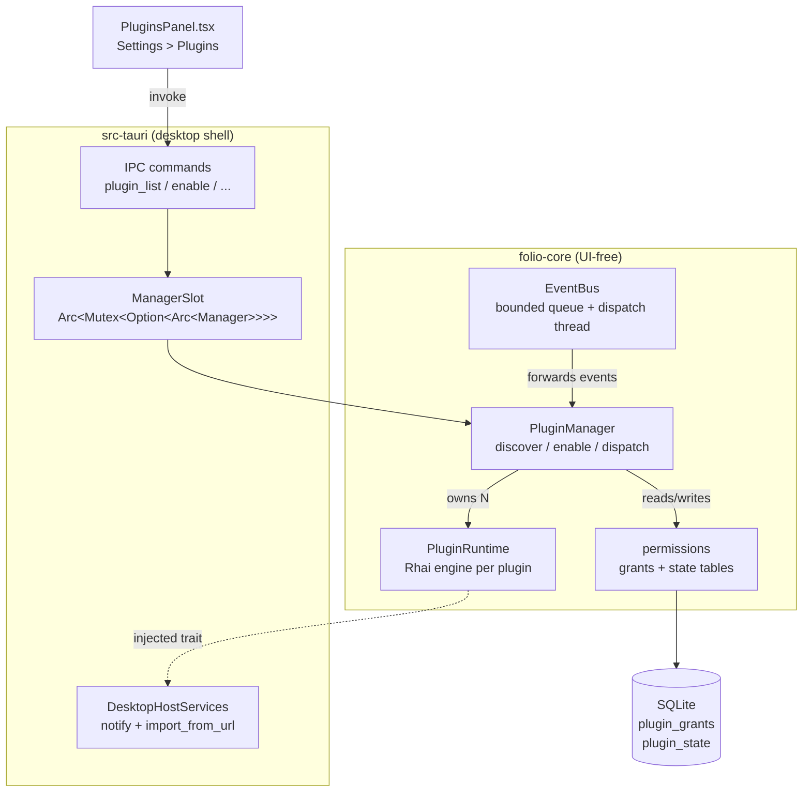
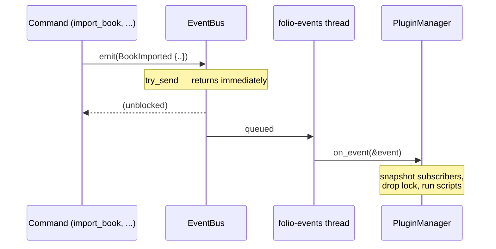
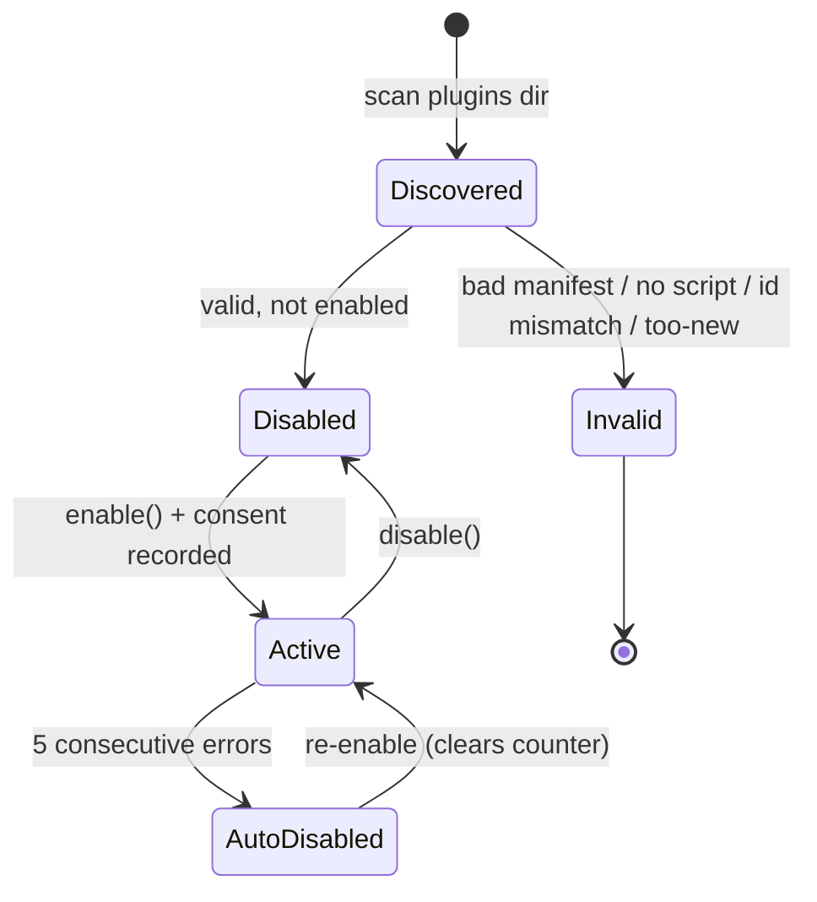
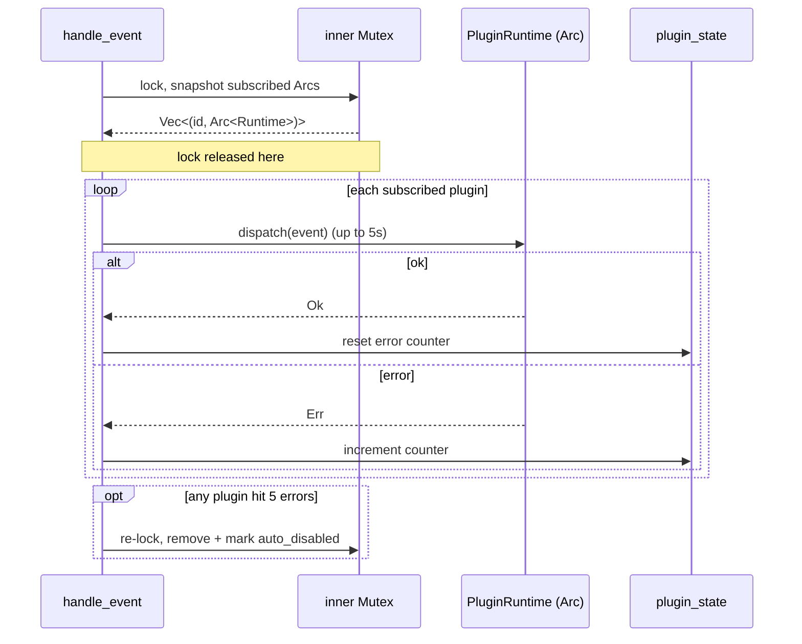
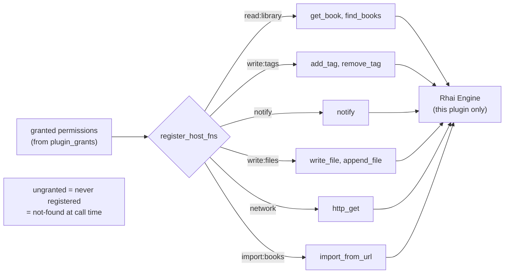
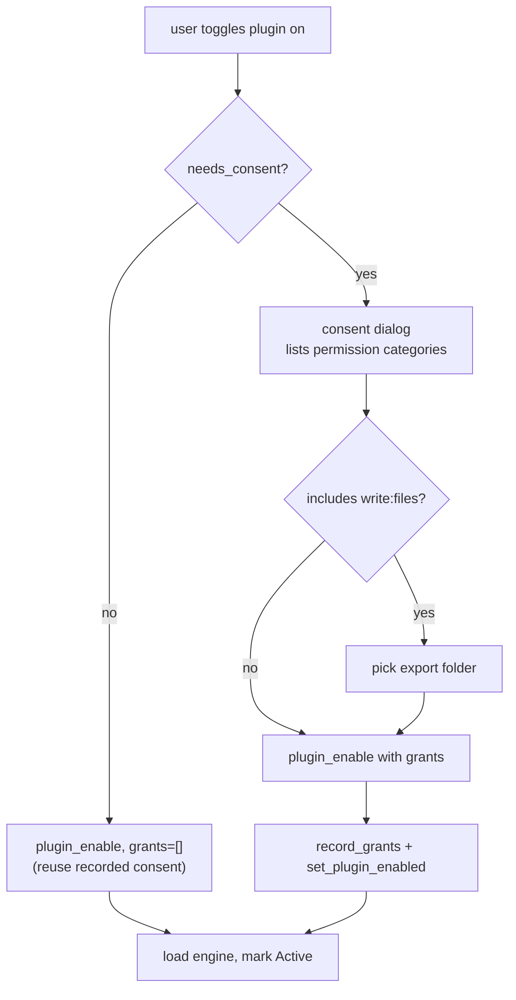
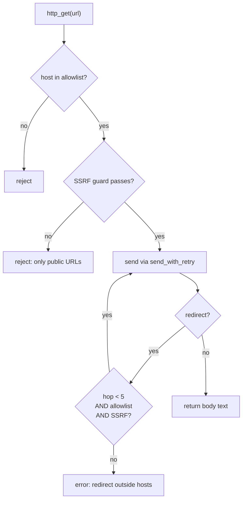
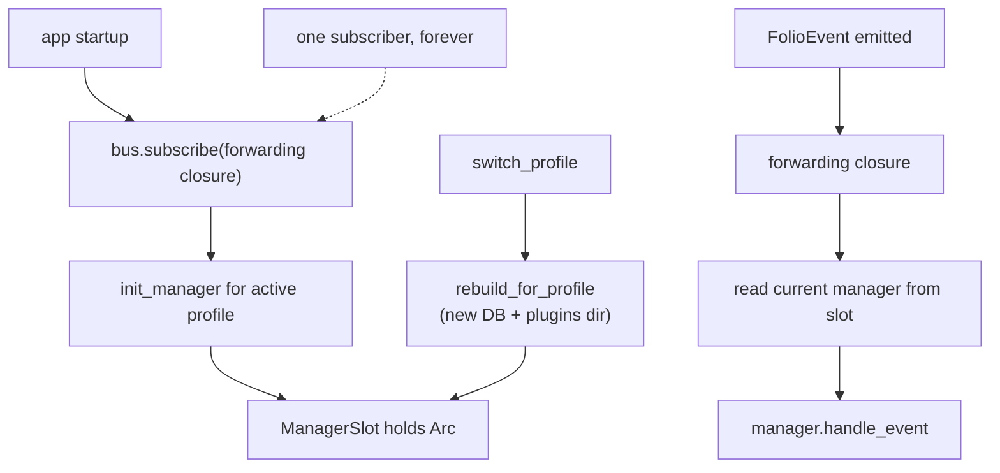

# Plugin system architecture

How the plugin/hook system is built, for people working on Folio itself. If
you just want to write a plugin, read [PLUGINS.md](./PLUGINS.md) instead — this
document is about the machinery underneath it.

The design spec it implements lives at
`docs/superpowers/specs/2026-06-12-plugin-hook-system-design.md`. Where this
doc and the spec disagree, the code wins; this is meant to track what shipped.

## The shape of it

Plugins are user-supplied [Rhai](https://rhai.rs) scripts that react to
lifecycle events. The whole thing splits across two crates, and the split
matters:

- `folio-core` owns the event bus, the manager, the Rhai runtime, and the
  permission model. It has no idea Tauri exists. Everything here is testable
  with a `tempfile` SQLite pool and a mock for the one trait it can't provide
  itself.
- `src-tauri` (the `folio` crate) is the desktop shell. It supplies the OS
  notification + book-import implementation, owns the manager instance, wires
  it onto the bus, and exposes the IPC commands the Settings UI calls.

The reason for that boundary: `folio-core` is UI-free and stays that way.
Anything that needs the OS or the running app gets injected through a single
trait (`HostServices`). A non-desktop host — a CLI, a test — provides its own.



## Events

### What an event carries

`FolioEvent` is a plain enum, one variant per hook point. The rule the whole
surface follows: payloads carry IDs, never full records.

```rust
pub enum FolioEvent {
    AppStarted,
    BookImported { book_id: String, format: BookFormat, source: ImportSource },
    BookOpened { book_id: String },
    HighlightCreated { book_id: String, highlight_id: String },
    // ... 12 variants total
}
```

That ID-only choice is deliberate. If the event handed plugins a full `Book`,
the event itself would be leaking your library data to any subscriber. Instead
a plugin gets an id, and to turn that id into a title or an author it has to
call a host function gated behind `read:library`. The event surface stays
permission-neutral; the permission model does the gating in one place.

Event names are a published contract — they're what manifests put in
`[events] subscribe`. `FolioEvent::name()` and `ALL_NAMES` are the single
source for them, and a test asserts every variant has a name and the two lists
agree. Rename a variant and that test fails before a stale manifest ever loads.

### The bus

`EventBus::emit` is fire-and-forget and never blocks the caller. That's the one
property everything else bends around: a slow plugin must not be able to wedge
the command that emitted the event.

It's a bounded `sync_channel` (capacity 256) feeding one dedicated dispatch
thread. Emitters `try_send`; the thread pulls events and runs every listener in
order. Three things fall out of that design:

- **Overflow drops, it doesn't block.** A full queue means the emitter
  increments a counter, logs, and moves on. Better to lose an event for
  listeners than to stall an import because a plugin is grinding.
- **Panics are contained.** Each listener runs inside `catch_unwind`. One
  listener panicking gets logged and the next listener still runs — the
  dispatch thread survives.
- **Order is preserved.** Listeners see events in emission order.



The process-wide instance is a `OnceLock` behind `bus()`. It's inert until
first touched — no thread spawns until something actually accesses the bus, so
tests that never use it pay nothing.

## The manager

`PluginManager` is the thing that turns folders on disk into running scripts.
It does four jobs: discover, load, dispatch, and track health.

### Discovery and load

Every direct subdirectory of the plugins folder is a candidate. Discovery reads
`plugin.toml`, validates it, and checks `main.rhai` exists. A folder that fails
any check still shows up in the list — as `Invalid` with the reason string — so
the UI can tell you *why* your plugin won't load instead of silently hiding it.

A plugin loads (its Rhai engine gets built) only if `plugin_state` says it was
enabled in a prior session. So the manager rebuilds your enabled set on every
startup without you re-approving anything.



### Dispatch without holding the lock

This is the part worth understanding. When an event arrives, the manager could
just lock its inner state and run every subscribed script. It doesn't — because
a script has a 5-second wall-clock budget, and holding the manager lock for 5
seconds would freeze `list`, `enable`, `disable`, and `reload` for the UI.

So `handle_event` snapshots the subscribed runtimes (each is an `Arc`), drops
the lock, *then* runs the scripts. It only re-acquires the lock at the end if
some plugin crossed the auto-disable threshold and needs to be unloaded. Rhai's
`sync` feature makes the runtime `Send + Sync`, which is what lets the `Arc`
cross that boundary.



### Self-disabling on repeated failure

A plugin that errors on 5 consecutive dispatches is unloaded and marked
`auto_disabled`, with an entry written to the activity log. A successful
dispatch resets the counter, so a plugin that fails occasionally won't trip it.

The counter lives in `plugin_state` in the database, not in memory. That's a
fix for a real bug: if the count lived in per-load in-memory state, a `reload`
midway through a failing streak would reset the timer and a broken plugin could
loop forever. There's a regression test (`reload_does_not_reset_the_auto_disable_counter`)
that pins this.

## The runtime sandbox

Each plugin gets its own `rhai::Engine`, built fresh at load time. The engine
is where the sandbox actually lives.

### Capability scoping by construction

There is no permission *check* at call time. Instead, the host functions for a
permission are only *registered on the engine* if that permission was granted.
Call `notify` without the `notify` grant and Rhai reports "function not found" —
because the function genuinely isn't in scope. Ungranted means absent, not
forbidden.



Two permissions register nothing even when granted unless they have what they
need. `write:files` registers no write functions without a chosen export
directory — the capability is inert rather than rooted at some unsafe default.
`network` registers `http_get` only if the manifest declared hosts. The
allowlist comes from the manifest, never from script input.

### Budgets

Every dispatch runs under hard limits, all from the spec:

| Limit | Value | Enforced by |
|-------|-------|-------------|
| Operations | 1,000,000 | `engine.set_max_operations` |
| Wall-clock | 5 seconds | `on_progress` watchdog |
| String size | 1 MB | `engine.set_max_string_size` |
| Call depth | 64 | `engine.set_max_call_levels` |
| `eval` | disabled | `disable_symbol("eval")` |

The wall-clock watchdog is worth a note: Rhai's operation hook fires
periodically, and the hook compares `Instant::now()` against a start time that
`dispatch` resets before each call. A `loop {}` with no operation budget left
would never return, so the time check is the backstop — the test
`runaway_script_is_aborted_by_budget` confirms an infinite loop dies well
under 10 seconds.

`dispatch` calls `on_event` with `call_fn::<Dynamic>` and throws the result
away. Earlier it used `call_fn::<()>`, which rejected any script whose
`on_event` happened to end on an expression ("Output type incorrect: string
expecting ()"). Accepting `Dynamic` and ignoring it is friendlier and just as
safe.

## Permissions and consent

### The taxonomy

Eight permissions, each mapping to a wire string used in both `plugin.toml`
and the `plugin_grants` table:

| Permission | Wire string | Host functions |
|-----------|-------------|----------------|
| ReadLibrary | `read:library` | `get_book`, `find_books` |
| ReadHighlights | `read:highlights` | `get_highlights` |
| WriteTags | `write:tags` | `add_tag`, `remove_tag` |
| WriteFiles | `write:files` | `write_file`, `append_file` |
| Notify | `notify` | `notify` |
| Network | `network` | `http_get` |
| ImportBooks | `import:books` | `import_from_url` |
| WriteMetadata | `write:metadata` | (reserved, none yet) |

### Consent

A grant is recorded the moment you approve the consent dialog. `needs_consent`
returns true when the manifest asks for any permission that has no recorded
grant. That single check drives the UI: a plugin needing consent can't be
enabled until you've gone through the dialog.

Re-enabling a plugin you've already approved doesn't re-prompt — the frontend
calls `plugin_enable` with empty grants and the backend reuses what's recorded.
But if a plugin update *adds* a permission, `needs_consent` flips back to true
and you get asked again, only for the new capability.



The grant for `write:files` stores the folder you picked as its parameter. That
folder is the root every write is confined to.

## Network and file-write defenses

These two are where a hostile plugin would aim, so they get extra scrutiny. A
security review during M4 caught several real holes here before merge — the
notes below are what the fixes look like.

### http_get

Two independent gates, both must pass:

1. The URL's host must be in the manifest allowlist (`host` or `host:port`).
2. The SSRF guard (`opds::is_safe_url_with_trusted` with no trusted entries)
   must pass — public HTTP/HTTPS only, no private or loopback addresses.

Allowlisting `127.0.0.1` does not get you to localhost: the SSRF guard runs
*after* the allowlist and blocks it anyway. Tests pin this for both bare IPs
and `host:port` entries.

The subtle one is redirects. reqwest follows them by default, so an allowlisted
host could 302 you to a private address or off-allowlist target and the initial
check would never see it. The fix is a custom `redirect::Policy` that re-runs
both gates on every hop and caps at 5:



The same per-hop revalidation backs `import_from_url`, which downloads through
`download_file_ssrf_guarded`. Import deliberately does *not* get the "trusted
hosts" relaxation that OPDS catalog browsing uses — a plugin importing a book
should never reach your LAN.

### write_file / append_file

Writes are confined to the granted export folder. `write_into_root` rejects, in
order: empty paths, absolute paths, any `..` component, a parent dir that
resolves (after canonicalization) outside the root, and — the case the review
added — a *leaf* that's a symlink pointing outside the root. Writes are
text-only and capped at 1 MB.

There's an honest limitation in the code comment: a check-then-open TOCTOU
window remains, and fully closing it needs `O_NOFOLLOW`. It's called out rather
than papered over.

## Persistence

The module owns two tables and creates them itself via `ensure_plugin_schema`,
called when the manager initializes. They're intentionally *not* part of
`db::run_schema`:

```sql
CREATE TABLE IF NOT EXISTS plugin_grants (
    plugin_id  TEXT NOT NULL,
    permission TEXT NOT NULL,
    params     TEXT,              -- export dir, etc.
    granted_at INTEGER NOT NULL,
    PRIMARY KEY (plugin_id, permission)
);
CREATE TABLE IF NOT EXISTS plugin_state (
    plugin_id          TEXT PRIMARY KEY,
    enabled            INTEGER NOT NULL DEFAULT 0,
    consecutive_errors INTEGER NOT NULL DEFAULT 0,
    auto_disabled      INTEGER NOT NULL DEFAULT 0
);
```

`plugin_grants` is the consent record; `plugin_state` is the enable flag plus
the auto-disable health counter. Keeping schema ownership inside the module is
what lets the plugin system stay self-contained — it doesn't touch the main
schema migration path at all.

## Desktop wiring

`folio-core` can't notify or import on its own, so `DesktopHostServices`
implements `HostServices`: `notify` goes through `tauri-plugin-notification`,
`import_from_url` calls the same `import_book_from_url` path the rest of the app
uses (dedup, copy-on-import, `ImportSource::Download`).

The manager itself lives in a `ManagerSlot` —
`Arc<Mutex<Option<Arc<PluginManager>>>>`. The reason it's swappable is profiles.
Folio supports multiple library profiles, each with its own database and
plugins folder. Switching profiles has to rebuild the manager against the new
DB, and an earlier version got this wrong by pinning the manager to the default
profile's database (caught in the M2 review).

The fix is a single, permanent bus subscriber installed once at startup that
reads whatever manager is currently in the slot:



So the bus never knows about profiles. It always forwards to one closure; the
closure forwards to whatever manager the slot points at right now. Profile
switch just swaps the `Arc` in the slot. The manager has to be initialized
before `AppStarted` is emitted, or the first event would arrive at an empty
slot.

## Scheduling, or the lack of it

There's no recurring scheduler in v1. A plugin that subscribes to `AppStarted`
runs once at launch; for anything on-demand there's the **Run now** button,
which fires `AppStarted` at one plugin (the bundled OPDS auto-downloader works
this way). `run_now` refuses any plugin not subscribed to `AppStarted`, so the
button can't be used to poke arbitrary scripts.

A real scheduler is recorded as a follow-up in ROADMAP #47 because it depends on
a background job queue (F-2-2) that doesn't exist yet. It was deferred on
purpose, not forgotten.

## Where things live

| Concern | File |
|---------|------|
| Event enum + bus | `folio-core/src/events.rs` |
| Manager (discover/load/dispatch) | `folio-core/src/plugins/mod.rs` |
| Manifest parse + validate | `folio-core/src/plugins/manifest.rs` |
| Permission taxonomy + persistence | `folio-core/src/plugins/permissions.rs` |
| Rhai runtime + host functions | `folio-core/src/plugins/runtime.rs` |
| SSRF-guarded download | `folio-core/src/opds.rs` |
| Desktop host services + IPC commands | `src-tauri/src/plugin_host.rs` |
| Bus wiring + manager init | `src-tauri/src/lib.rs` |
| Settings UI | `src/components/PluginsPanel.tsx` |
| Bundled examples | `src-tauri/resources/example-plugins/` |
| Author's guide | `docs/PLUGINS.md` |
