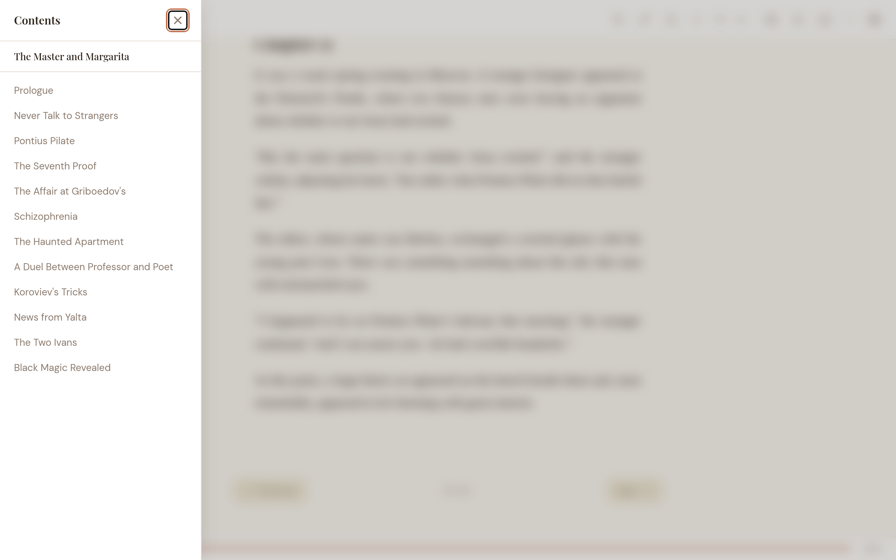
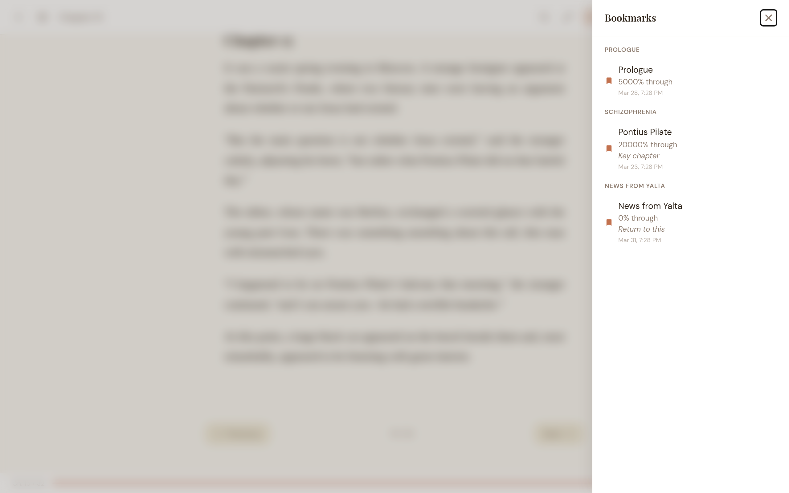
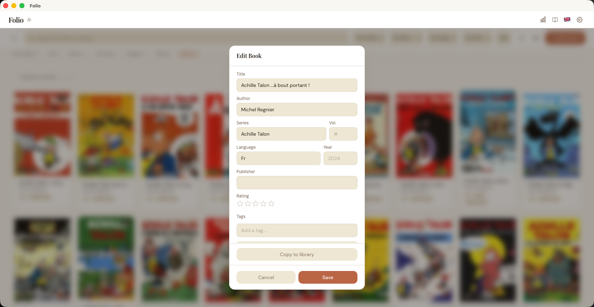
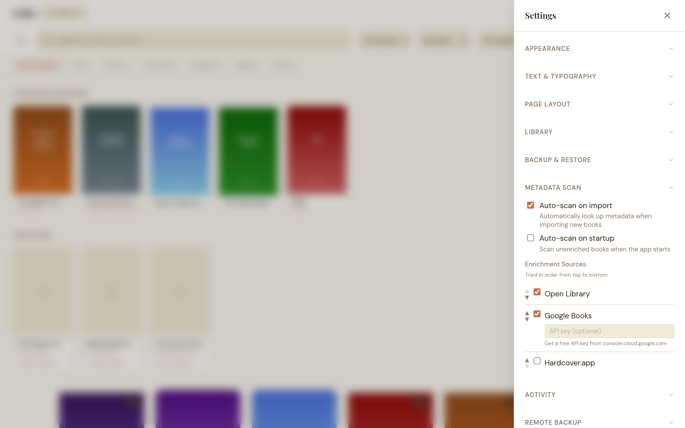
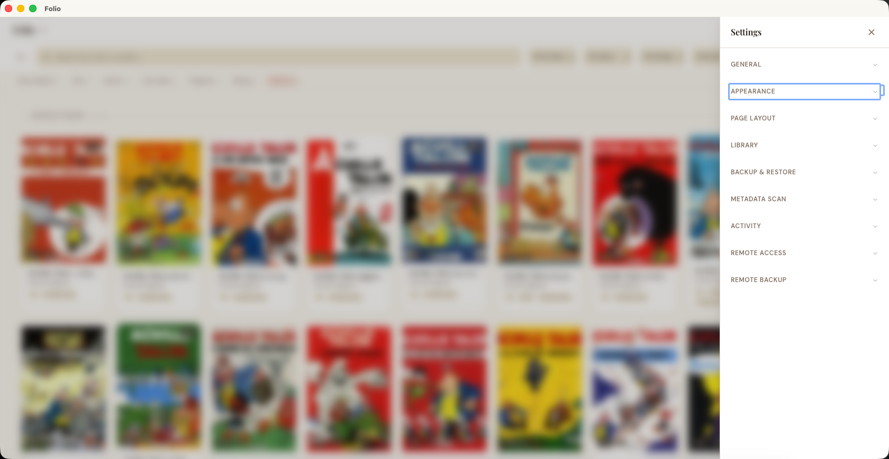
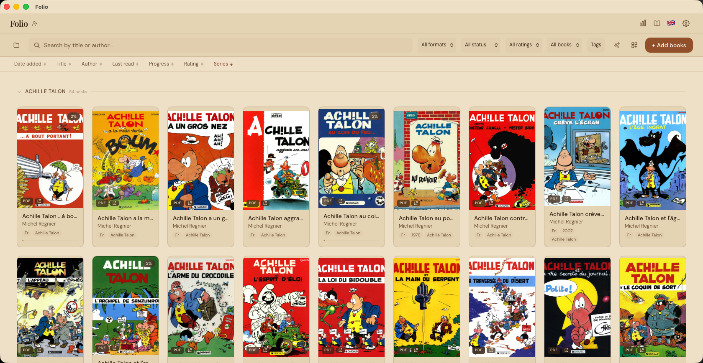
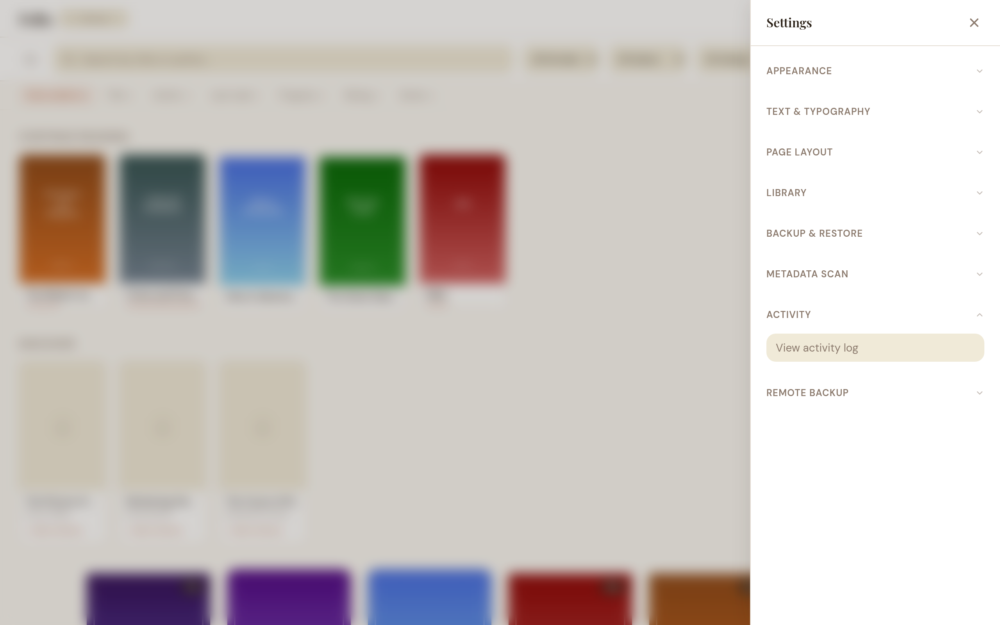
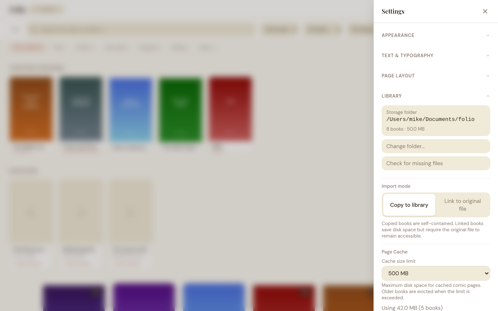
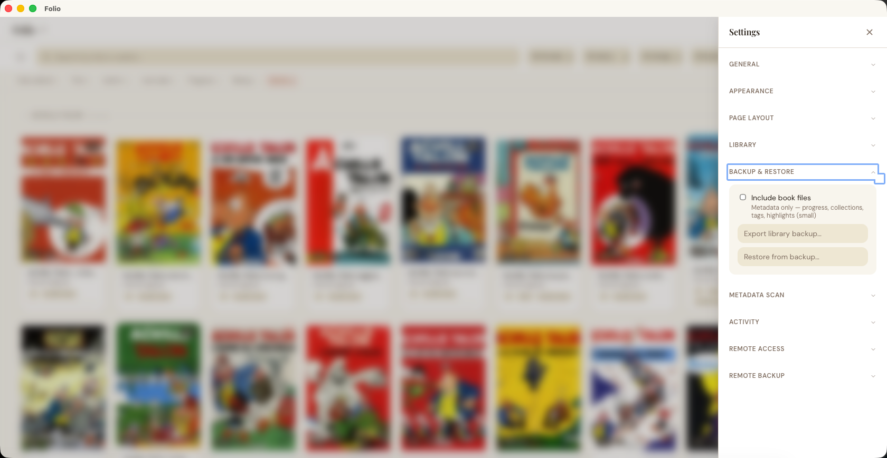

# Folio — User Guide

How to install, import books, and read them. Covers all formats, collections, highlights, catalog browsing, and more.

---

## Table of Contents

1. [Getting Started](#1-getting-started)
2. [Managing Your Library](#2-managing-your-library)
3. [Collections](#3-collections)
4. [Reading a Book](#4-reading-a-book)
5. [Highlights and Bookmarks](#5-highlights-and-bookmarks)
6. [Book Metadata and Enrichment](#6-book-metadata-and-enrichment)
7. [Catalog Browsing (OPDS)](#7-catalog-browsing-opds)
8. [Profiles](#8-profiles)
9. [Customizing Your Reading Experience](#9-customizing-your-reading-experience)
10. [Backup and Restore](#10-backup-and-restore)
11. [Reading Stats](#11-reading-stats)
12. [Remote Access](#12-remote-access)
13. [Language](#13-language)
14. [Keyboard Shortcuts](#14-keyboard-shortcuts)
15. [Troubleshooting](#15-troubleshooting)

---

## 1. Getting Started

### System requirements

| Platform | Minimum version |
|----------|----------------|
| macOS    | 10.15 Catalina or later |
| Windows  | Windows 10 (64-bit) or later |
| Linux    | Ubuntu 20.04 or equivalent |

No extra runtimes or dependencies needed. The installer is self-contained.

### Downloading

Go to the [GitHub Releases page](https://github.com/mikedamoiseau/folio/releases) and grab the package for your OS:

- macOS: `.dmg`
- Windows: `.msi`
- Linux: `.AppImage` or `.deb`

### Installing

**macOS:** Open the `.dmg`, drag Folio into your Applications folder, then double-click to launch it.

> **macOS Gatekeeper — "damaged" or "unidentified developer" warning**
>
> Because this app is not notarized, macOS 14 (Sonoma) and later may block it with a _"Folio.app is damaged and can't be opened"_ message.
>
> **Fix (recommended, no Terminal):** in Applications, right-click (Control-click) **Folio.app**, choose **Open**, then click **Open** again in the dialog. On macOS 15 (Sequoia) and later, if there is no **Open** option, double-click once, then open **System Settings → Privacy & Security** and click **Open Anyway**. Only needed the first time — macOS remembers the choice.
>
> **Alternative (Terminal):** run `xattr -cr /Applications/Folio.app`, then launch normally. This removes the quarantine flag and only needs to be done once after each install or update.

**Windows:** Run the `.msi` installer and follow the prompts.

**Linux (AppImage):** Make the file executable (`chmod +x Folio.AppImage`), then run it.

**Linux (.deb):** Run `sudo dpkg -i folio.deb`.

### First launch

The first time you open the app, a short onboarding wizard guides you through the basics in three steps:

1. **Welcome** — introduces Folio and what it does.
2. **Import a Book** — pick individual files, scan a folder, or drag and drop. The wizard advances automatically once your first import completes.
3. **Quick Tips** — highlights Focus Mode (press **D** while reading), online catalogs (Project Gutenberg, Standard Ebooks, and more), and drag-and-drop import.

You can skip the wizard at any step — it won't appear again. Everything stays on your machine; nothing is sent to the cloud.


---

## 2. Managing Your Library

### Supported formats

| Format | Type |
|--------|------|
| EPUB 2 and EPUB 3 | Reflowable ebooks |
| PDF | Fixed-layout documents |
| CBZ | Comic book archives (ZIP) |
| CBR | Comic book archives (RAR) |

### Importing books

Click the **+ Add books** button in the top-right corner to open the import menu:

- **Add files:** Opens a file picker for one or more files in any supported format.
- **Import folder:** Scans an entire directory for supported files and imports them in batch, with a progress indicator.
- **Import from URL:** Paste a direct link to an EPUB, PDF, CBZ, or CBR file. Folio downloads and imports it.

**Drag and drop:** You can also drag files from Finder or File Explorer directly onto the library window. A "Drop to import" overlay appears. Release to import them.

When you import a book, Folio copies the file into its own managed library folder (default `~/Documents/folio/`). The original file is not modified or moved. Duplicate files are detected by content hash and skipped automatically.

**Re-scanning a folder is fast.** If you import the same folder again — for example to resume after an interrupted batch, or to pick up newly added books — Folio skips files it has already imported without re-reading their contents, as long as the file is unchanged (same path, size, and modification time). Only new or changed files are read in full. This makes re-importing a large folder from a network drive or external disk quick, even with thousands of books.

### Viewing your books

Books are shown as a cover grid. Each card displays the cover image, title, author, star rating (if set), a reading-status badge, and a format badge for non-EPUB books.

The status badge (top-right of the cover) reflects where you are with a book:

- **Active** (green, shows the percentage) — in progress and read within the last 14 days
- **Paused** (amber, shows the percentage) — in progress but untouched for more than 14 days
- **Finished** (a checkmark) — read to the end
- **Unread** books show no badge

In the full library view, a **"Continue Reading"** row at the top shows your most recently read books, and a **"Discover"** row shows popular titles from your configured OPDS catalogs. Both sections are hidden when viewing a collection or series, so you see only the relevant books.

The grid is built for large libraries: covers are stored as lightweight thumbnails and only the rows currently on screen are rendered, so scrolling stays smooth even with thousands of books.

### Searching and filtering

- **Search:** Type in the search bar to filter by title or author. Results update as you type.
- **Format filter:** Filter by All, EPUB, PDF, CBZ, or CBR.
- **Status filter:** Filter by All, Unread, In Progress, or Finished.
- **Rating filter:** Filter by minimum star rating (1+ through 5 stars).
- **Sorting:** Sort by date added, title, author, last read, progress, rating, or series — ascending or descending.
- **Source filter:** Filter by All, Imported, or Linked books.
- **Tag filter:** Click the "Tags" button to open a searchable dropdown of all your tags. Select one or more tags to filter — only books with all selected tags are shown (AND logic). Selected tags appear as chips on the button. Your tag selection persists between sessions.

All filters combine, so you can search for "asimov" within "epub" books tagged "sci-fi" that are "in progress."

### Book details and editing

Click the **(i)** button on a book card (visible on hover) to open the book detail popup — it shows cover, series, language, and quick actions (open, edit, export).


Hover over a book card to reveal action buttons:

- **Edit:** Opens a dialog to change the title, author, cover image, and tags. See [Book Metadata and Enrichment](#6-book-metadata-and-enrichment).
- **Delete:** Removes the book from your library (with a confirmation prompt).

### Bulk actions

To act on multiple books at once, click the **selection icon** in the toolbar (grid icon next to the import button). This enters selection mode:

- Click book cards to select or deselect them. A checkbox appears on each card.
- A floating action bar appears at the bottom showing the selection count.
- **Select all / Deselect all** — toggle between selecting all visible books or clearing the selection.
- **Delete** — remove all selected books (with a confirmation dialog showing the count).
- **Cancel** — exit selection mode.

Selection mode disables drag-and-drop to prevent accidental actions. Your selection is kept while you stay in selection mode and is cleared when you exit.

**Undo:** deleting a book, deleting a selection, and removing a book from a collection all show a brief **Undo** toast — click it within a few seconds to reverse the action before it's applied.

---

## 3. Collections

Collections let you organize books into groups. Open the collections sidebar by clicking the collections icon or pressing `C`. It opens as a panel over your library — click anywhere outside it, or press `Esc`, to close it.


A **filter box** at the top of the panel narrows both the collections and the series lists to names that match what you type (case-insensitive); the clear button empties it. The **Collections** and **Series** lists each have a header you can click to collapse or expand them independently, so a long list can be tucked away. Typing in the filter temporarily reveals matches inside a collapsed list, then restores your collapse choice when you clear it. "All Books" always stays visible, and both the filter text and collapse state reset when you close the panel.

### Manual collections

Create a collection, then drag book cards onto it to add them. You can remove books from a manual collection via the book card's context actions.

### Automated collections

Define rules and Folio populates the collection automatically. Available rule types:

| Field | Operators |
|-------|-----------|
| Author | contains, is |
| Title | contains |
| Series | contains, is |
| Language | is, contains |
| Publisher | contains |
| Description | contains |
| Format | is (epub, pdf, cbz, cbr) |
| Tag | is, contains |
| Date added | within last N days |
| Reading progress | is unread / in progress / finished |

Multiple rules are combined with AND logic — a book must match all rules to appear in the collection.

### Smart suggestions

Click **Suggest Collections** at the bottom of the sidebar. Folio analyzes your library and offers rule-based collection templates based on patterns it finds:

- **Authors** with 3 or more books
- **Series** with 2 or more books
- **Reading status** — "Unread books" or "Finished books" when enough qualify
- **Format** — non-dominant formats (e.g. "PDF Books" when most of your library is EPUB)

Each suggestion card shows how many books match. You can **Add** (create immediately), **Edit** (tweak rules before creating), or dismiss. Suggestions that duplicate an existing automated collection are hidden automatically.

### Collection options

- Custom icon (choose from preset emoji)
- Custom color (choose from preset palette)
- Export as Markdown
- Delete collection

### Series grouping

Books with series metadata are automatically grouped in two ways:

- **Sidebar:** A "Series" section appears below collections, showing each series with its book count. Click a series to filter the library to just those books, sorted by volume order.
- **Sort by Series:** Select the "Series" sort option in the library toolbar. Two view modes are available via a pill toggle at the right end of the sort bar:
  - **Expanded** (default): Books are grouped under collapsible series headers, sorted by volume within each group.
  - **Stacked**: Each series appears as a single tile — the first book's cover with fanned-out covers behind it, series name and book count below. Click a stack to drill into that series. A back bar with ← arrow returns to the stacked view and restores your scroll position. Press Escape to go back.

  Books without series data appear at the bottom in both modes. The selected view mode is remembered across sessions.

Series data comes from book file metadata (EPUB/CBZ). You can also set or edit series info manually via the edit dialog on any book.

---

## 4. Reading a Book

### Opening a book

Click any book card to open it. If you've read it before, Folio picks up where you left off — same chapter (or page), same scroll position.


### EPUB reading

Folio offers two reading modes for EPUBs, selectable in **Settings > Page Layout**:

**Paginated mode** (default) — read one chapter at a time:

- **Chapter navigation:** Use the Previous/Next buttons at the bottom, press the left/right arrow keys, or pick a chapter from the Table of Contents. Folio prefetches the neighbouring chapters in the background, so turning to the next or previous chapter is instant.
- Floating chapter arrows appear on the left/right edges when you scroll past the bottom navigation bar.

**Continuous scroll mode** — all chapters in one long scrollable document:

- All chapters are loaded and rendered as a single scrollable page with chapter title dividers between them.
- Scroll naturally through the entire book — no prev/next buttons needed.
- The Table of Contents still works: clicking a chapter scrolls directly to it.
- The footer progress bar shows your position in the entire book (not just the current chapter).

**Common to both modes:**

- **Table of Contents:** Click the list icon in the header or press `T`. The sidebar shows a searchable, hierarchical chapter list. The current chapter is highlighted.

  

- **Focus mode:** Press `D` to hide all UI and read distraction-free. Move the mouse to the top or bottom edge to temporarily reveal controls.
- **Book details:** Click the **(i)** icon in the reader header to open a read-only popup with the book's title, author, format, series, publisher, year, language, and full description — handy for checking a synopsis without leaving the page. Press `Escape` or click the **✕** (or outside the popup) to close it.
- **Progress tracking:** Your reading position is saved automatically and restored when you reopen the book, in either mode — unless "Don't track this session" is on, in which case your place is only remembered for the rest of the current app session (see [Don't track this session](#dont-track-this-session) below).

### PDF and comic book reading (PDF, CBZ, CBR)

These formats use a page-by-page viewer. Navigate with the Previous/Next buttons or arrow keys. The footer shows the current page number and total page count.

**Go to page:** Click the page label (e.g., "Page 5 / 45") in the footer bar. It turns into a number input — type the page you want and press Enter. Press Escape or click away to cancel.

**Thumbnail strip:** Click the three-bar icon in the header (or press `M`) to open a horizontal strip of page thumbnails below the reader. Click any thumbnail to jump to that page — the jump is recorded in navigation history so back/forward returns to the source page. Pages closest to the one you're reading decode first, so the strip fills outward from the current page. The strip remembers its open/closed state per book.

**Split view:** Click the two-rectangle icon in the header (or press `\`) to read two books side-by-side. The companion pane starts on the same book; click "Choose another book" in its header to pick a different library entry. Each pane has its own reading progress, navigation history, and zoom — Folio writes both books' progress as you read (paused for both panes together if "Don't track this session" is on, since it's one app-wide toggle). The pane you last clicked is the "active" pane (a subtle accent ring shows which one); arrow keys and shortcuts target it. The primary pane has a swap-panes button when a companion is set, and the companion pane has an X to close split view from its side. Split state and the companion pairing persist per book, so reopening the primary restores both panes.

**Page cache (CBZ/CBR):** When you open a comic for the first time, Folio extracts all pages from the archive to a disk cache. The first page (and your last-read page) paint instantly while the remaining pages extract in the background behind a dismissible "preparing pages" bar, so even a large comic opens in a fraction of a second — you can start reading and jump anywhere right away, and any page that hasn't been extracted yet is read on demand. Subsequent page turns read from disk and are near-instant (~1-5ms). The cache persists between sessions — reopening the same comic skips extraction entirely. Cache is managed automatically via eviction (max 5 books, configurable size cap, 7-day expiry). You can adjust the cache size limit or clear it in Settings > Library.

**Page cache (PDF):** PDFs also use the same on-disk page cache. When you open a PDF, Folio renders the first ten pages at a high canonical resolution and writes them to the cache, then renders the rest of the book's pages into the cache on a background task behind a dismissible "caching pages" bar — so going to any page or scrubbing the thumbnail strip becomes instant. On very large PDFs the background pass stops once the cache size limit is reached, and any page not yet cached is still rendered on demand. Reopening the same PDF in a later session reads pages from disk instead of re-running pdfium — typically a 10–100× speed-up on the first-page render. Cache budget, LRU, and 7-day expiry are shared with the comic cache.

**Zoom quality:** When you zoom into any page-based format, Folio keeps images sharp. Uncached PDFs (linked books, storage errors, or the first viewport-only fallback render) are rendered by pdfium at the requested zoom width, so the result is as sharp as the viewport demands. Cached PDFs are served from the canonical 2400 px disk render and downscaled to fit the viewport — at zoom levels that request more than 2400 px wide, the cached image is passed through without upscaling, so very high zoom on a cached page may look softer than a fresh render. Comic pages (CBZ/CBR) are displayed using physical DOM resizing so the browser resamples at full resolution instead of blurring. PDF pages are returned as high-quality JPEG images with an in-memory cache for fast navigation.

**Slow page loading:** Some PDF pages with complex content may take longer to render. If a page takes more than 8 seconds, Folio shows a "taking longer than usual" hint while continuing to load. If it exceeds 30 seconds, a retry button appears. Retrying is often instant since the render may have completed in the background and been cached.

### Reading progress

Progress is saved automatically as you read. The library shows a percentage on each book card. When you reopen a book, you return to exactly where you stopped — as long as "Don't track this session" isn't on (see below).

Folio also records reading sessions (time spent, pages read) for the reading stats dashboard, again unless "Don't track this session" is on.

### Don't track this session

Open the toggle in the header (the eye icon, next to the language switcher) to pause passive reading tracking for the rest of the current app session — useful if you're reading something you'd rather not show up in your stats or recently-read list. Click it to see exactly what pauses and what doesn't, and to switch it on or off.

**Paused while it's on:**

- Reading progress — your place in books
- Reading-time stats and streaks
- The recently-read / "Continue Reading" list
- Reading entries in the activity log (deliberate library actions, like importing or deleting a book, are still logged)

**Still saved:**

- Highlights and bookmarks — they stay in their lists exactly as normal
- The book itself stays in your library

While it's on, closing a book and reopening it later in the same app session still resumes where you left off — Folio just remembers that position in memory for the session instead of writing it to the library database. Restarting Folio always starts fresh with tracking back on; the setting is never remembered between launches, so the indicator can never show a state that doesn't match what's actually happening.

This isn't an incognito or encryption feature — it only pauses the passive tracking listed above. Anything you deliberately save (a highlight, a bookmark) keeps working exactly as before.

### Book completion celebration

When you reach the last page or chapter of any book, Folio shows a celebratory modal with a confetti animation. The modal displays:

- The book's cover image
- Total reading time accumulated across all sessions (any time read while "Don't track this session" was on isn't included, since it was never recorded)
- An interactive star rating — tap a star to rate the book immediately

Click **Continue** to dismiss. The celebration only appears once per book; reopening a finished book won't trigger it again. The event is logged in the activity log as "Book Finished," unless "Don't track this session" was on when you finished it.

### Dictionary / word lookup (offline)

Look up a word's definition without leaving the page. This is off by default and
uses a one-time offline download — no network lookups once installed.

**Enable it once:**

1. Open **Settings → Dictionary** and turn on the in-reader dictionary.
2. Click **Download dictionary** (~7 MB). A progress bar shows the download and
   a short "Verifying…" step; when it finishes you'll see the WordNet version
   and size, with a **Delete** button to remove it later and reclaim the space.

The dictionary is a prebuilt database derived from Princeton WordNet 3.1. It is
downloaded once and shared across all your profiles.

**Look up a word:** in the desktop reader, select a single word and click
**Define** in the selection popup. A card appears next to your selection
showing the word's definitions grouped by part of speech (noun, verb,
adjective, adverb), each with an example and synonyms where available.
Inflected forms resolve to their base word — selecting "running" defines "run",
and the card notes the "running → run" mapping. Click anywhere outside the card
(or its ✕) to dismiss it.

If a word isn't found, the card says so; if you never enabled the dictionary,
the Define button doesn't appear.

> Notes: the dictionary is English and offline-only in this version (an online
> fallback and custom dictionaries may come later). The Define action is
> available in the desktop reader only.

### Vocabulary builder

Turn the words you look up into a study list. This is off by default and builds
on the dictionary above.

**Enable it once:** in **Settings → Dictionary**, turn on **Build my vocabulary
list**. From then on, every word you **Define** in the reader is saved to a
personal list for the current profile — along with its definition, the book you
were reading, and the sentence the word appeared in. Nothing is saved until you
turn this on, and past lookups aren't backfilled.

**Your list:** open the **Vocabulary** screen from the top navigation (it
appears once the feature is on, or whenever you have saved words). Each entry
shows the word, its definition, the sentence and book it came from, and how many
times you've looked it up. You can delete a word, or clear the whole list. A
search box filters the list as you type (by word, definition, or book). Click a
saved word to reopen its book and jump to the spot where you looked it up — the
word briefly flashes so it's easy to find (jumping is unavailable once the source
book has been removed from your library).

**Review with flashcards:** click **Review due (N)** at the top of the
Vocabulary screen to quiz yourself on the words that are due (N is how many).
Each card shows the word first; reveal the definition, then mark **Got it** or
**Missed**, and the next due card follows. Getting a word right moves it up a
box so it comes back less often; missing it sends it back to daily review (a
five-box spaced-repetition schedule of roughly 1, 3, 7, 14, and 30 days). A word
is due as soon as you save it, so newly added words are ready to review right
away; once you've reviewed everything, the button shows **Review due (0)** and
is disabled until a word's next review date comes around.

> Notes: saved words keep their definitions even if you later delete the
> dictionary or the source book. Turning the setting back off stops saving new
> words but keeps everything you've already collected.

### Returning to the library

Click the back arrow in the top-left corner or press `Escape`. Your progress is saved when you exit, unless "Don't track this session" is on.

---

## 5. Highlights and Bookmarks

### Highlights (EPUB and PDF)

Select text while reading to see a color picker popup. Choose from five colors: yellow, green, blue, pink, or orange. The highlighted text is saved with its position.

**PDFs (desktop reader):** PDF pages have a selectable text layer over the rendered page, so you can drag to select text and either **Copy** it to the clipboard or highlight it — exactly like EPUB. PDF highlights are saved per page, reappear as colored bands when you return to the page, and can be removed from the popup. They show up in the Highlights panel, cross-book highlight search, and shareable quote cards alongside your EPUB highlights. A selection stays within one page — on a two-page spread, each page selects on its own. (The web reader shows PDFs as page images only, without the text layer.)

Open the highlights panel (pen icon in the reader header) to:

- View all highlights grouped by chapter
- Add or edit notes on any highlight — notes use a multi-line text area, press Cmd/Ctrl+Enter to save
- Click a highlight to jump to that chapter
- Delete individual highlights
- Export all highlights as Markdown (copied to clipboard)
- **Share a highlight as an image** — see below


**Share as image:** turn a highlight into a shareable quote card. Use **Share as
image** either from the selection popup while reading, or per-highlight in the
Highlights panel. A dialog shows a live preview with a few choices — a **style**
(Light, Sepia, or Dark), whether to **include the book's cover**, and whether to
show a small **Folio** wordmark. Then **Copy image** to put the card on your
clipboard (paste it into Messages, Slack, etc.) or **Save as PNG…** to write it
to a file. Long quotes are trimmed to fit; books without a cover or author just
omit those bits.

### Cross-Book Highlight Search

Search across all your highlights and notes from the library toolbar. Click the highlighter-search icon (between the tag filter and bulk select buttons) to open a search modal.

- Type to search — results appear instantly, grouped by book
- Each result shows the highlight text, color, optional note, and chapter number
- Click any result to open that book in the reader
- Searches both highlight text and notes

### Bookmarks

Press `B` in the reader to bookmark the current position. Bookmarks are listed alongside your reading progress.



---

## 6. Book Metadata and Enrichment

Click the edit button on any book card to open the metadata editor.



### Editable fields

- Title
- Author
- Series and volume number
- Language
- Publisher and publish year
- Cover image (upload a JPG, PNG, or WebP)
- Star rating (1-5 stars — click a star to rate, click the same star again to clear)
- Tags — type a tag name and press Enter or comma to add it. Comma-separated input creates multiple tags at once (e.g., "japan, manga"). Existing tags appear as autocomplete suggestions. Tags are shown as removable chips.

### Enrichment providers

Folio can look up metadata from multiple sources. Providers are tried in order — the first one that finds a match wins. Configure which providers are active in **Settings > Metadata Scan > Enrichment Sources**.

| Provider | Coverage | API Key | Default |
|----------|----------|---------|---------|
| **Google Books** | General books, good international coverage | Optional (for higher rate limits) | Enabled |
| **OpenLibrary** | Open data, ratings, subjects | None | Enabled |
| **Comic Vine** | Comics, BD, manga — the most comprehensive free comics database | Free key from comicvine.gamespot.com/api | Disabled (needs key) |
| **BnF** | French national library — excellent for French editions | None | Enabled |

Providers are tried in the order shown. Use the ▲/▼ buttons next to each provider to change the priority — the first provider to return a match wins.

Click "Search" in the edit dialog to look up your book by title and author. From the results you can pull in description, genres, and ratings.

### Automatic metadata scanning

Folio can automatically look up metadata for your books. The scan uses multiple strategies in order of confidence:

1. **ISBN lookup** — if the book contains an ISBN in its metadata, Folio does a direct lookup (highest accuracy)
2. **Title + Author search** — searches providers and auto-applies if the match is strong
3. **Filename parsing** — for CBR/CBZ comics and files with no embedded metadata, Folio parses the filename to extract title, author, and year

**Scan controls:**

- **Scan Library** button in the toolbar (magnifying glass icon) — scans all unenriched books. Also retries previously skipped books (they may match with newly enabled providers).
- **Per-book scan** — click the scan icon in the book detail popup to enrich a single book. The popup updates immediately with the new metadata.
- **Progress indicator** — shows "Enriching 3/12: Book Title" with a cancel button

**Settings** (in Settings > Metadata Scan):

- **Auto-scan on import** (default: on) — newly imported books are automatically queued for metadata lookup
- **Auto-scan on startup** (default: off) — scan unenriched books when the app launches



### Comics metadata

Comics (CBZ and CBR) get metadata from two sources:

- **ComicInfo.xml** — if present inside the archive, Folio extracts writer, title, series, volume, year, language, publisher, genre, and summary automatically at import time.
- **Enrichment providers** — Comic Vine is recommended for comics. Get a free API key from comicvine.gamespot.com/api, enable it in Settings, then run a scan.

---

## 7. Catalog Browsing (OPDS)

Folio can browse online book catalogs that use the OPDS protocol (Open Publication Distribution System). Three default catalogs ship out of the box — Project Gutenberg, Standard Ebooks (New Releases), and Wikisource — and you can add more from a curated preset list or by entering any OPDS URL by hand.

### Browsing

Open the catalog browser from the library. Pick a catalog to browse its categories and entries. Each entry shows the title, author, summary, and cover when available.


### Searching

**Unified search:** From the catalog list, type a query in the "Search all catalogs" bar. Folio searches every configured catalog in parallel and shows aggregated results — one search, all sources.

**Per-catalog search:** When browsing inside a catalog that supports search, a "Search this catalog" bar appears at the top.

### Downloading

Click a download link to grab a book (EPUB, PDF, CBZ, CBR, or MOBI/AZW/AZW3) and import it directly into your library. When the catalog reports a file size, it's shown next to the download.

### Adding more catalogs

Two paths from the catalog list view:

- **Browse presets** — opens an inline picker with a curated list of OPDS catalogs (Gallica, OpenEdition, ManyBooks, arXiv, Elephant Editions, Hungarian / Bulgarian libraries, Anarchist Library, others). Filter by language, by category, or with the search box. Click **+ Add** on any row to install it. Already-added presets show an "Added" badge.
- **Add custom URL** — enter the OPDS root URL of any catalog, including self-hosted Calibre/COPS servers and other Folio instances on your LAN (e.g. `http://192.168.0.12:7788/opds`). The URL is validated and Folio runs a quick connection test before saving, so a typo or unreachable feed is caught immediately instead of failing later when you browse.

Custom catalogs can be removed at any time (with a confirmation). If you ever have no catalogs, the panel shows a shortcut to the preset picker.

---

## 8. Profiles

Profiles give you completely separate libraries. Each profile has its own books, reading progress, collections, and highlights.

Create and switch profiles from the profile dropdown in the library header. The dropdown only appears once you have more than one profile. Non-default profiles can be deleted.

### Profile lock

You can lock a profile behind a password, from **Settings → Profile lock**. This hides the profile from anyone using the app casually — a housemate, or someone picking up your laptop — by requiring the password before it can be switched into (including at app startup, if the locked profile is the one that opens automatically).

**A profile lock hides this profile in the app. It does not encrypt your books, database, or cached pages — anyone with access to this computer's files can still read them.** It's a deterrent, not encryption: don't rely on it to protect the profile's contents on a device someone else can access at the file-system level (e.g. an unencrypted disk, a cloud sync of your app-data folder, or a shared machine with another OS-level account). This also means a locked profile is not served over the web/OPDS remote-access server until it has been unlocked in the desktop app for that session — the profile password is never asked for over the web.

- **Setting a lock:** open Settings → Profile lock while the profile you want to lock is active, and choose a password. Any passphrase works — it isn't limited to digits like the web-access PIN.
- **Switching into a locked profile** prompts for its password. There's no lockout after wrong attempts — the check itself is intentionally slow enough to discourage guessing.
- **Changing or removing a lock** from Settings requires the current password.
- **Forgot the password?** The unlock prompt has a "Can't sign in?" link that clears the lock after a deliberate confirmation step. This never touches your books or library — it only removes the lock, exactly like knowing the password and removing it yourself.

---

## 9. Customizing Your Reading Experience

Click the gear icon in the reader header (or library toolbar) to open Settings.



Settings are grouped into collapsible sections. Use the **search box** at the top to filter sections by name or keyword (e.g. "pin", "css", "backup") and jump straight to what you need.

### Theme

Choose from four presets or create your own:

- **Light** — warm off-white with brown text (default)
- **Sepia** — deeper amber/parchment background with rich brown text, designed for comfortable extended reading
- **Dark** — dark background with light text for low-light environments
- **Auto** — follows your operating system's light/dark setting

| Light | Sepia | Dark |
|:-:|:-:|:-:|
|  |  |  |

**Custom colors:** Click the "Custom colors" button to open the color editor. Pick a background and text color — the remaining UI colors (borders, accents, muted text, etc.) are automatically derived. Expand "Advanced" to fine-tune individual color tokens. Preset buttons let you reset to the sepia or light palette.

### Saved themes

Save your current visual setup as a named theme to quickly switch between different reading moods. A saved theme captures colors, font family, font size, and all typography settings (line height, margins, alignment, spacing, hyphenation).

**Saving a theme:**

1. Configure your preferred appearance — colors, font, and typography settings
2. In **Settings > Appearance > Saved Themes**, click **+ Save as theme**
3. Enter a name (e.g., "Night Reading", "Beach Mode") and click **Save**
4. If the name already exists, you'll be asked to confirm overwriting

**Loading a theme:** Click any saved theme in the list to apply it instantly. The active theme is highlighted with an accent background. Loading a theme switches to custom color mode and applies all saved settings.

**Managing themes:**

- **Rename:** Hover over a theme and click the pencil icon. Edit the name inline and press Enter to confirm.
- **Delete:** Hover over a theme and click the X icon. Confirm the deletion when prompted.
- Up to 50 themes can be saved. Names are case-insensitive ("Dark" and "dark" are treated as the same name).

**What is NOT saved in a theme:** Custom CSS is a global override layer and is not included in saved themes. A note below the save button reminds you of this.

### Font size

Adjust between 14px and 24px using the slider, the +/- buttons in Settings, or the A-/A+ buttons in the reader header.

### Reading font

Choose from four built-in fonts for EPUB reading content:

- **Lora** — elegant serif font (default)
- **Literata** — a serif font designed for e-reading (created by Google for Play Books)
- **DM Sans** — clean sans-serif font
- **OpenDyslexic** — a font designed for readers with dyslexia, with weighted letterforms that prevent visual rotation and flipping

You can also add your own fonts: click **Add font...** at the bottom of the font list and select a `.ttf`, `.otf`, or `.woff2` file. Custom fonts appear alongside the built-in options. To remove a custom font, hover over it and click the X icon.

A live preview sentence shows the selected font. Built-in fonts are bundled locally — no internet connection required.

### EPUB reading mode

Toggle between two modes for how EPUB content is displayed:

- **Paginated** (default) — one chapter at a time with prev/next navigation
- **Continuous** — all chapters in one long scrollable document with chapter dividers

This is a global preference that applies to all EPUB books.


### Dual-page spread

Show two pages side by side, like an open book. Works for all formats: comics (CBZ/CBR), PDFs, and EPUBs in paginated mode.

**Toggling on/off:**

- **Reader header:** Click the dual-page icon (two rectangles) in the header bar. When active, the icon highlights.
- **Settings > Page Layout:** Toggle "Dual-page spread" on or off.

**Page pairing:** The cover page (page 1) always displays solo. Subsequent pages are paired: 2-3, 4-5, 6-7, etc. If the last page has no partner, it displays solo.

**Manga mode (right-to-left):** When dual-page is active, a second button appears in the header bar (left arrow icon). Toggle it to swap the page order within each spread — the right page displays on the left and vice versa. This also reverses the arrow key direction so that left-arrow advances forward, matching the RTL reading direction. For EPUBs, manga mode flows the text columns right-to-left.

**Zoom and pan:** In dual-page mode, zoom and pan apply to both pages as a unit. Pan is bounded so you can't drag the content off-screen.

Both settings are global (apply to all books) and persist between sessions. Dual-page is automatically hidden when EPUB is in continuous scroll mode.

### Page turn animation

A slide animation plays when turning pages in PDF and comic (CBZ/CBR) formats. The new page slides in from the side with a brief fade, giving a natural sense of direction when navigating forward or backward.

**Toggle:** Settings > Page Layout > "Page turn animation" — enabled by default. Turn it off for instant page changes with no animation.

**Performance:** Adjacent pages are preloaded in the background after you pause on a page, so the animation plays smoothly. During fast navigation, preloads are deferred to keep the current page responsive.

This setting does not affect EPUB, which uses its own chapter-based navigation.

### Full-text search (EPUB)

Search the full text of any EPUB book:

- Click the **magnifying glass** icon in the reader header or press **⌘/Ctrl+F** to open the search bar.
- Type at least 2 characters to see results. Matches appear with chapter name and a text snippet.
- Click a result to jump to that chapter. Search highlights appear in blue in the text.
- Results are capped at 200 matches. If you hit the cap, try a more specific query.
- Press **Escape** to close the search panel.

### Advanced typography

Fine-tune your reading experience under **Settings > Appearance > Typography**:

- **Line height** — adjust spacing between lines (1.2× to 2.4×)
- **Page margins** — control horizontal padding (0px to 80px)
- **Text alignment** — choose between left-aligned or justified text
- **Paragraph spacing** — set the gap between paragraphs (0em to 2em)
- **Hyphenation** — toggle automatic word breaking at line endings for tidier justified text

All typography settings apply to EPUB content only and are saved globally.


### Custom CSS

For advanced customization, you can inject your own CSS that applies to EPUB reading content:

1. Open **Settings > Appearance** and scroll to the Custom CSS section
2. Type or paste CSS rules in the text area
3. Changes apply immediately with a live preview
4. Use the **Clear** button to remove all custom CSS

Example uses: adjusting heading sizes, hiding specific elements, changing link colors, or modifying list styles.

### Time-to-finish

While reading an EPUB, the footer shows an estimated reading time:

- **"X min left"** — estimated time remaining for the entire book, based on 250 words per minute
- Hover over the time to see a tooltip with both chapter-level and book-level estimates

The estimate updates as you scroll through the content.

### Activity log

Folio keeps a log of data-changing actions (imports, edits, deletes, collection changes, etc.):

- Open **Settings > View Activity Log** to browse recent activity
- Filter by action type (e.g., only imports, only edits)
- Each entry shows the action, affected item, and timestamp



### Library folder and import mode

In Settings > Library, you can view your current library folder path, the number of imported books (copied into the folder) and total storage used, plus a count of linked books that live outside the folder. You can change the library folder — Folio will offer to move existing files to the new location or keep them in place.



**Import mode:** Choose between two modes for how books are added:

- **Copy** (default) — the file is copied into Folio's managed library folder. Safe and self-contained.
- **Link** — Folio references the file at its original location without copying. Useful for large libraries on external drives or NAS. Linked books show a link badge on their card.

**Page cache:** Folio caches extracted comic pages (CBZ/CBR) and rendered PDF pages on disk for faster reading. The cache size limit controls the maximum disk space used across both formats (default 500 MB). You can choose 250 MB, 500 MB, 1 GB, or 2 GB. The current cache usage and a "Clear cache" button are shown below the setting.

---

## 10. Backup and Restore

### Local backup

From **Settings > Backup & Restore** you can export and restore library backups.



**Export options:**

- **Metadata only** — small file containing your book metadata, reading progress, bookmarks, highlights, collections, and tags.
- **Full backup** — includes book files alongside the metadata. Linked books (not copied into the library) keep a reference to their original location rather than embedding the file. Cover images are stored as compact thumbnails to keep the archive small.

**Restore from backup:** Click "Restore from backup" to open the restore picker:

- **Automatic backups** — Folio creates automatic backups before destructive operations like library cleanup. These are listed with their date, type, and file size. Click "Restore" on any entry.
- **From file** — Click "Choose file" to select a backup ZIP you exported previously.

Restoring a backup brings back your books and covers along with reading progress, bookmarks, highlights, collections, and tags. Existing data is not deleted — it's a non-destructive merge, and restoring the same backup twice is safe. Linked books are restored as references to their original path, so that location must be reachable (e.g. the drive mounted) on the machine you restore to. The library view refreshes automatically once the restore finishes.

### Library cleanup

From **Settings > Library**, click "Check for missing files" to scan your library for books whose files no longer exist on disk (moved, deleted, or on a disconnected drive). Folio automatically creates a metadata backup before removing any broken entries. The result shows how many books were removed and where the backup was saved.

If you try to open a book whose file is missing, Folio shows a dialog offering to remove it from your library.

### Remote backup

Folio can sync your library to a remote storage provider for off-site backup. Configure in **Settings > Remote Backup**.


**Supported providers:**

| Provider | Auth | Notes |
|----------|------|-------|
| AWS S3 | Access key + secret | Any S3-compatible service (MinIO, Backblaze B2, etc.) |
| FTP | Username + password | FTP and FTPS (TLS) |
| SFTP (SSH) | Username + SSH key | Key-based auth via system ssh |
| WebDAV | Username + password | Nextcloud, ownCloud, etc. |

**How it works:**

1. Select a provider and fill in connection details
2. Click **Save** to store the configuration (passwords are stored in your OS keychain, not in the database), or **Test connection** to verify the details reach the server — each reports its own result, so you can tell a save problem from a connection problem
3. Click **Backup Now** to start a sync

**What gets synced:** Book files, covers, reading progress, bookmarks, highlights, and collections. Metadata files (JSON) always contain the full library. Book files are uploaded incrementally — only new or changed files are transferred.

**Progress:** During backup, the button shows real-time status like "Uploading books 3/12" or "Syncing bookmarks".

**Reliability:**
- If a backup is interrupted, the next run picks up where it left off — already-uploaded files are detected by size comparison and skipped
- Both successful and failed backups are logged in the activity log
- Only one backup can run at a time (a second click is blocked while one is in progress)

### Multi-device sync

Folio can sync your reading progress, bookmarks, and highlights across multiple devices. Sync uses the same remote storage provider you configure for backup.

**Enabling sync:**

1. Configure a remote backup destination (S3, FTP, SFTP, or WebDAV) as described above
2. In **Settings > Remote Backup**, toggle **"Sync reading progress across devices"** on

**How it works:**

- **When you open a book:** Folio silently checks the remote storage for sync data from other devices. If another device has newer reading progress, bookmarks, or highlights, they are merged into your local library. This happens in the background with a 5-second timeout — your book opens immediately regardless.
- **When you close a book:** Folio pushes your current reading state to the remote storage in the background. Other devices will pick up these changes next time they open the same book.
- **Book matching:** Books are matched by content hash (SHA-256), so the same file on different devices syncs correctly even if the filenames differ.

**What syncs:**

- Reading position (chapter and scroll position)
- Bookmarks (including names and notes)
- Highlights (including colors and notes)
- Deletions — if you remove a bookmark or highlight on one device, it's removed on others too

**What does not sync:**

- Book files themselves (use backup for that)
- Collections, tags, or star ratings
- Reading statistics
- Settings or theme preferences

**Conflict resolution:** When the same item is edited on two devices, the most recent edit wins (based on timestamps). If timestamps are equal, the remote version is preferred. This is automatic — there's no manual conflict resolution.

**Sync status:** When sync is enabled, the Settings panel shows the time of the last successful sync. If a sync fails (network issues, server unreachable), a user-friendly error message is displayed. Errors clear automatically after the next successful sync.

**Sync and backup are independent:** Sync is a lightweight, per-book data exchange for reading state. Backup is a full library export. You can use one without the other, though both require a remote storage provider. Enabling sync does not trigger a backup and vice versa.

---

## 11. Reading Stats

Open the reading stats dashboard from the library toolbar (bar chart icon).


**Tracked metrics:**

- **Books** — total number of books in your library
- **Time Reading** — total time spent in the reader
- **Sessions** — number of reading sessions
- **Pages Read** — total pages turned (PDF/CBZ/CBR)
- **Books Finished** — books read to completion
- **Current Streak** — consecutive days with reading activity
- **Longest Streak** — your all-time record

A **30-day bar chart** shows your daily reading time over the past month.

**Reading goals** — a "Reading goals" card lets you set two targets: a **yearly goal** for how many books you want to finish (shown as a progress ring with an ahead/behind-schedule pace indicator), and a **daily goal** for how many minutes you want to read each day (shown as a progress bar that fills through the day and marks "Goal met!" once you reach it). Both are optional — set either from the card — and are computed from data Folio already tracks.

Stats are tracked automatically — reading sessions are recorded when you open and close a book, unless "Don't track this session" is on (see [Don't track this session](#dont-track-this-session)), in which case that session's time simply isn't recorded.

---

## 12. Remote Access

Browse and read your library from any device on the same WiFi network — phone, tablet, or another computer — without installing anything. Two surfaces are available, toggled independently:

- **Web UI** — an HTML library browser for phones, tablets, and other computers
- **OPDS** — an Atom catalog feed for ebook reader apps (KOReader, Thorium, Calibre, Moon+ Reader, …)

The server runs whenever at least one toggle is on. Turn both off to stop the server entirely.

### Setting up

1. Open **Settings** and scroll to the **Remote Access** section
2. Enter a **PIN** (this is the password for web access) and click **Save PIN**. An "Unsaved" indicator appears while the typed PIN differs from the saved one, and a valid PIN is also saved automatically when you click away — so you won't lose it by closing the panel mid-type.
3. Tick **Web UI**, **OPDS**, or both
4. A URL and QR code appear — scan the QR code with your phone or type the URL in any browser

The server runs on port 7788 by default. The port input is editable while the server is running — change the value and click outside the field to apply.

### Using the web interface

When **Web UI** is enabled, open the URL in a browser. It looks and behaves like the desktop app — same warm color palette, light/dark/system theme, and typography — not a stripped-down mobile page. You'll see:

- **Login screen** — enter the PIN you set in the desktop app
- **Home** — "Continue Reading" and "Recently Added" shelves for quick access to what you're currently in the middle of
- **Library** — a grid of book covers with search, series/collection filters, and a sort dropdown (date added, title, author, last read, rating). The grid loads more books automatically as you scroll, so it stays fast even on large libraries. Books you've started show a small progress badge on the cover. Tap any book to see its details.
- **Book detail** — shows cover, title, author, format, and a progress bar. Tap **Continue** to pick up where you left off (or **Start Over** to read from the beginning), or **Download** to save the file to your device.
- **Reader** — EPUBs show chapter content with prev/next navigation; Folio prefetches the neighbouring chapters in the background, so turning to the next chapter is instant even over the network. PDFs and comics show page images with prev/next buttons, and swiping left/right on a touch screen turns the page with a short animation. You can zoom into a page up to 5× with Ctrl+scroll (or a Mac trackpad pinch) and pan around it by scrolling — on a touch screen, pinch with two fingers to zoom and drag with one finger to pan, or double-tap to jump to 2.5× and double-tap again to zoom back out; zoom resets when you turn the page or switch fit mode. (Tap-to-turn waits a fraction of a second to distinguish a double-tap.) Your reading position is saved as you go, so opening the same book later — on this device or another — resumes where you stopped. Note: "Don't track this session" is a single app-wide switch shared with the desktop app, so if it's on there, reading here pauses tracking too, even though the web UI has no toggle or indicator of its own for it.
- **Reading Stats** — open it from the bottom tab bar (on a phone or tablet) or the bar chart icon in the header (on a desktop browser) to view your reading stats: total books, time read, sessions, pages, books finished, current and longest streaks, and a 30-day daily reading chart.
- **Collections** — open it from the bottom tab bar (on a phone or tablet) or the folder icon in the header (on a desktop browser) to browse your collections and series. Filter by name, sort alphabetically, and tap any collection or series to jump to a filtered library view.

On a phone or tablet the main sections — Library, Collections, and Reading Stats — sit in a **bottom tab bar** within thumb reach, and the header keeps just the title, search, and theme toggle; on a desktop browser those sections stay as icons in the top-right of the header. Controls are sized for comfortable tapping, tapping a control gives a brief press response rather than the sticky mouse-hover highlight, and — once added to your home screen on a notched phone — the app runs edge-to-edge, clearing the status bar and home indicator.

The web interface works entirely on your local network. No internet connection needed, no data leaves your WiFi.

### Installing to your home screen

The web UI can be installed like an app, so it opens full-screen without browser chrome and gets its own icon:

- **iOS (Safari):** open the web UI URL, tap the **Share** icon, then **Add to Home Screen**.
- **Android / desktop (Chrome or another Chromium browser):** open the web UI URL, then use the browser's **Install app** option (usually in the address bar or the ⋮ menu).

Once installed, the app shell (not your book content) can be cached for faster loads — this only kicks in when the page is served over `https` or accessed as `localhost`. Over a plain HTTP address on your home WiFi (the normal way to reach it, e.g. `http://192.168.1.20:7788`), the app still installs to your home screen and looks the same, it just always fetches the shell fresh rather than caching it offline.

### Keyboard shortcuts

On a device with a keyboard, the web UI supports the same kind of shortcuts as the desktop app:

- `/` — focus the search box from the library view
- `Tab` — move focus between book covers in the grid (with a visible focus ring); `Enter` or `Space` opens the focused book
- In the reader: `←`/`→` to turn pages or move between chapters, `Home`/`End` to jump to the first/last page, `Space` to scroll, `F` to toggle fullscreen, `Esc`/Backspace to go back
- `?` opens a shortcuts overlay listing the full set

### OPDS for reader apps

When **OPDS** is enabled, ebook reader apps can connect directly:

1. In the reader app, add a new OPDS catalog
2. Enter the URL: `http://<your-ip>:7788/opds`
3. For authentication, use HTTP Basic Auth with any username and your PIN as the password
4. Browse your library and download books directly into the reader app

You can run **OPDS without the Web UI** if you only use external reader apps — smaller surface, no HTML pages exposed.

### Auto-start

Whatever surfaces were enabled when you last closed Folio start automatically the next time you open the app. Untick both checkboxes to disable auto-start.

### Tray menu

The system tray shows the same two toggles (Web UI: ON/OFF, OPDS: ON/OFF). Click either to flip its state without opening Settings.

### Security

- Your PIN is hashed (SHA-256) and stored in your operating system's keychain
- Web sessions expire after 24 hours
- Login attempts are rate-limited (5 tries per 5 minutes per device)
- Login attempts are recorded to an audit trail (see below)
- The server is read-only — nobody can modify your library from the web interface
- All served content is sanitized to prevent malicious scripts in EPUB files

### Login audit trail

Folio keeps a security audit log of login attempts against the remote-access server, so you can review who has been trying to reach your library.

- Each entry records the timestamp, the device's IP address, the connecting app (user-agent), and the outcome — **success**, **invalid PIN**, or **rate-limited**.
- Web login attempts (the PIN screen) record all outcomes. OPDS reader-app connections record only failed attempts, to avoid filling the log with one entry per page an app loads.
- Your PIN is never written to the log — only whether an attempt succeeded.
- Entries are kept for 90 days (and capped at the most recent 5,000) and then pruned automatically.
- The trail is readable only by an authenticated client, via `GET /api/audit/login-history` on the running server.

### Data export

Folio can export a copy of your personal data from the remote-access server, for backup or data-portability (GDPR) purposes.

- Request `GET /api/data-export` from an authenticated client. The server returns a timestamped ZIP (`folio-export-YYYYMMDD.zip`) containing a single JSON document.
- The export includes your books metadata, reading progress, bookmarks, highlights, the activity log, and your settings.
- Credentials are never exported: backup configuration and metadata-provider API keys are excluded, and your PIN (stored separately) is never included.
- The endpoint requires authentication, and is refused entirely unless a web PIN is configured — it will not serve your data on an open, unauthenticated server.

### Stopping the server

Untick both checkboxes (or use the tray menu). The server also stops automatically when you close the Folio app.

---

## 13. Language

Folio supports multiple interface languages. Currently available: **English** and **French**.

**Switching language:** Click the flag icon in the library toolbar or reader header. A dropdown shows available languages with flag emojis. Select one to switch immediately — no restart needed.

**Auto-detection:** On first launch, Folio detects your operating system language. If it matches a supported language, that language is used. Otherwise, English is the default.

**Persistence:** Your language choice is saved and remembered across sessions.

**Adding languages:** Folio's translation architecture supports community contributions. Each language is a single JSON file.

---

## 14. Keyboard Shortcuts

Press `?` at any time to see the shortcut reference.


### Library

| Shortcut | Action |
|----------|--------|
| `/` | Focus search bar |
| `C` | Toggle collections sidebar |
| `Escape` | Clear search / close panels |
| `?` | Toggle shortcut help |

### Reader

| Shortcut | Action |
|----------|--------|
| `←` | Previous chapter / page |
| `→` | Next chapter / page |
| `⌘/Ctrl+F` | Search in book (EPUB only) |
| `T` | Toggle Table of Contents |
| `B` | Add bookmark |
| `D` | Toggle focus mode |
| `M` | Toggle page thumbnails (PDF / CBZ / CBR) |
| `\` | Toggle split view |
| `Escape` | Close panel / exit focus mode / back to library |
| `?` | Toggle shortcut help |

---

## 15. Troubleshooting

### "Failed to load book"

The file is probably corrupted or uses a format variant the parser can't handle. Try re-downloading the file, or open it in another reader to check if the file itself is the problem.

### macOS — import from a network share fails with "No such file or directory (os error 2)"

If importing from an SMB network share (a NAS mounted under `/Volumes/...`) fails with `Cannot stat file: No such file or directory (os error 2)` — typically for files with accented characters in their names (`é`, `à`, `è`, …) — the file itself is fine. This is a bug in macOS's SMB client: the file shows up when listing the folder, but macOS fails to open it by name. It affects every application on the Mac, not just Folio — even `cat` in Terminal fails on the same file.

Workarounds, in order of convenience:

- **Rename the file on the server** (e.g. via your NAS's web file manager) to remove the accented characters, then import normally.
- **Copy the file to your Mac without going through the SMB mount**, e.g. with `scp` or `rsync` over SSH, and import the local copy.
- **Mount the share over NFS instead of SMB** if your NAS supports it — the NFS client does not have this bug.

### Supported formats

Folio supports **EPUB** (versions 2 and 3), **PDF**, **CBZ**, and **CBR** on every platform. **MOBI**, **AZW**, and **AZW3** are supported on arm64 macOS, Linux, and Windows release builds; the Intel (x86_64) macOS build is the only release that ships without MOBI support. DjVu is not supported.

MOBI support uses [libmobi](https://github.com/bfabiszewski/libmobi) (LGPL v3+). How libmobi is delivered depends on the platform:

- **macOS (arm64 / Apple Silicon):** No installation step needed. The arm64 macOS build statically links libmobi into the app, so it is fully self-contained.
- **Linux (Debian / Ubuntu):** `sudo apt install libmobi0` (the `.deb` declares this as a dependency, so an `apt install` of Folio will pull it in automatically). Linux uses dynamic linking.
- **Linux (Fedora / RHEL):** `sudo dnf install libmobi`.
- **Windows:** No installation step needed. The Windows build statically links libmobi into `folio.exe`, so the installer is fully self-contained.

If you do not need MOBI support, use the Intel (x86_64) macOS release build — it ships without the `mobi` feature and has no libmobi dependency.

### Where is my data stored?

**Library database and app data:**

| Platform | Location |
|----------|----------|
| macOS    | `~/Library/Application Support/com.mike.folio/` |
| Windows  | `%APPDATA%\com.mike.folio\` |
| Linux    | `~/.local/share/com.mike.folio/` |

**Book files:** Imported books are copied to the library folder, which defaults to `~/Documents/folio/`. You can change this in Settings. Since Folio keeps its own copy of each book, moving or deleting the original file has no effect on your library.

### The app won't start

Check that your OS meets the minimum version listed in [Getting Started](#1-getting-started).

**macOS — "damaged and can't be opened" or "unidentified developer":** This is a Gatekeeper quarantine flag on unsigned apps. Easiest fix: right-click (Control-click) **Folio.app** in Applications, choose **Open**, then click **Open** again. Or, after a blocked launch, go to **System Settings > Privacy & Security** and click **Open Anyway**. If neither works, clear the flag from Terminal and try launching again:

```bash
xattr -cr /Applications/Folio.app
```
